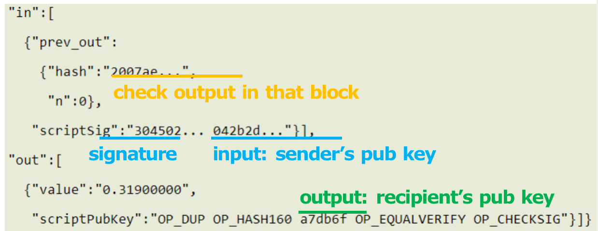
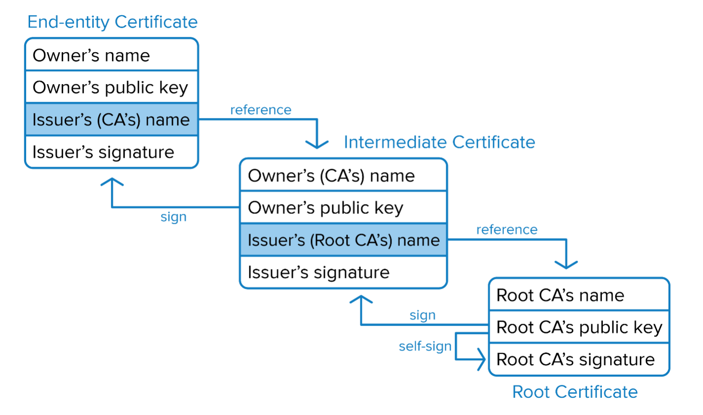
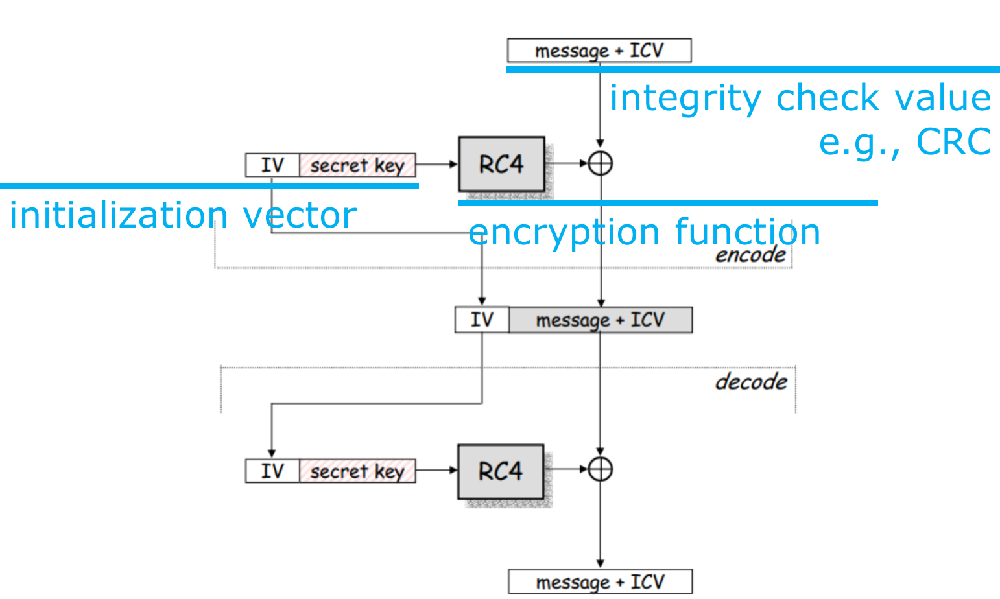

#### Cryptography

What:

+ Confidentiality - secrecy
+ Integrity - accuracy
+ Authentication - ascription
+ Non-repudiation - liability

Symmetric vs. Asymmetric

RSA

1. Two large numbers $p$ and $q$

2. $n = p\times q$

    $r=\varphi(n)=(p-1)(q-1)$

    $e$ such that $\gcd(e,r)=1$

    $d$ such that $ed\equiv1\mod r$

3. $(n,e)$ -> public key

4. $(n,d)$ -> private key

Replay Attack

+ How to defend:

    Timestamp

    One-time session key

Man-In-The-Middle Attack

+ Defense: Guarantee connection authenticity

Relay Attack

+ Innocent customer, Alice, pays for lunch by entering her smartcard and PIN into a modified terminal operated by Bob.

    At approximately the same time, Carol enters her fake card into honest Dave's terminal to purchase a diamond.

    The transaction from Dave's terminal is relayed wirelessly to Alice's card with the result of Alice unknowingly paying for Carol's diamond.

+ Defense: Distance Bounding

    $RTT=2\times distance/velocity$

#### Blockchain

Double spending

+ Follow the longest fork
+ Accept the transaction until at least 5 more blocks follow it

Eclipse(蒙蔽) attack

+ Hacker controls a large number of IP addresses or a distributed botnet.
+ Victim directs all outgoing connections to the IP addresses controlled by the attacker

Sybil attack

+ Hacker takes control of multiple nodes
+ Victim is surrounded by fake nodes that close up all their transactions

Selfish mining attack

+ Attacker increases the share of reward by not broadcasting mined blocks to the network for some time and then releaseing several blocks at once, making other miners lose their blocks
+ Block withholding attack aka

#### Secure Connection

SSL/TLS

1. Client Hello
2. Server Hello
3. Premaster secret
4. Session key creation
5. Master secret is used to generate symmetric session keys
6. Client finished
7. server finished
8. Exchange messages

HTTPS

1. Connection request

    1. DNS Hierarchy
    2. DNS Resolution
    3. DNS Hijacking

2. Server response

    1. Client Hello

        + SSL protocol version
        + Session ID
        + List of Cipher Suites
        + Client Hello extensions

    2. Server Hello

        + SSL protocol version
        + Session ID
        + Selected Cipher
        + Server Certificate -> public key
        + Server HELLO Extensions
        + Client Certificate Request (optional)

    3. Certificate

        + Vouch for server public key

            (is) Signed by CA's private key

            (and is) Verifiable by CA's public key

3. Certificate verification

    + What to verify

        + Certificate Authority
        + Certificate Date
        + Certificate Revocation List
        + Domain Name

    + How to verify

        + Domain Name
        + CA Name
        + CA Signature
        + Public Key

    + Certificate Chain

        

    + CRL (Certificate Revocation List) check

        + Certificates that have been revoked by the issuing CA before their scheduled expiration date and should no longer be trusted
        + Two states: 
            revoked: irreversibly revoked
            Hold: only temporary invalidity, reversible
        + Periodically issued by a CRL issuer CA perse
            or some other trusted third parties
        + Query supported as well
        + Trade off between security and efficiency
        + Always a time gap between 
            when a certificate is revoked AND
            when its revocation approaches a client

Threats

+ Eavesdropping - Encryption
+ Manipulation - Integrity (MAC)
+ Impersonation(假冒) - signature

#### Anonymous Communication

Anonymity for mortals (凡人)

+ Unmonitored access to health and medical information
+ Preservation of democracy:
    anonymous election/jury
+ Censorship(审查制度) circumvention(规避):
    anonymous access to otherwise restricted information

Anonymity for Attackers

+ Misbehaviors without getting caught:
    Terrorism, Darknet, Spam, Pirate, …

Overlay Network

+ Handle routing at the application layer
+ Tunnel messages inside other messages

Anonymizing Proxy

+ Advantages
    + Easy to configure
    + Require no active participation of receiver, which need not be aware of anonymity service
    + Have been widely deployed on Internet
+ Disadvantages
    + Require trusted third party
        proxy may release logs,
        or sell them,
        or blackmail sender
    + Anonymity largely depends on the (likely unknown) location of attacker

Evade Attacker
Source routing, specify on-path routers by source

+ POF(Protocol Oblivious Forwarding)-based Source Routing
    Port sequence leaked
+ Onion routing
    Source-routing based overlay anonymous communication
    + Connect to Tor entry
        Randomly select a series of Tors
        Relay messages across them
        Tor exit relays messages to destination
    + Reply traffic from destination traverses the reverse path 
    + Maintains a bidirectional persistent multi-hop path between source and destination

#### Secure Routing

Deliver Scheme:

+ unicast: dominant form of msg delivery on internet
+ broadcast
+ multicast
+ anycast: deliver msg to any one of a group
+ Geocast: deliver a massage to a group of nodes based on geographic location

Routing Scheme

+ Intra-domain routing (域内)

    inside an autonomous system

+ Inter-domain routing (域间)

    Between autonomous system

Route Computation

+ Link-state algorithm

    each router knows complete topology & link cost information;

    independently run routing algorithm to calculate shortest path to              each destination;

+ Distance-vector algorithms

    each router knows direct neighbors & link costs to neighbors;

    independently calculate shortest path to each destination through an iterative process based on neighbors’ distances to dest;

+ Hierarchical Routing

Routing attacks

+ distance-vector:
    	announce 0 distance to all other nodes
+ link-state: 
    	drop links; claim direct link to other routers
+ BGP:
    	announce arbitrary prefix; alter paths

Prefix Hijacking

+ Case 1:

    Hijack and drop packets;

    Block customers

+ Case 2:

    Claim a shorter path that may direct to a malicious router or a path more easily for packet to be intercepted

RPKI (Resource Public Key Infrastructure)

+ certified mapping from ASes to public keys and IP prefixes)

+ Insufficient

    Malicious router can pretend to connect to the valid origin

S-BGP

+ Each AS on the path cryptographically signs its announcement;

    Guarantees that each AS on the path made the announcement in the path:
        AS path indicates the order ASes were traversed;
        No intermediate ASes were added or removed;

+ Deployment challenges:

    ​	Complete, accurate registries
    ​	Public key infrastructure
    ​	Cryptographic operations
    ​	Need to perform operations quickly
    ​	Difficulty of incremental deployment

#### Wi-Fi Security

Higher security risk

+ Broadcast Communication

    wireless networking typically involves broadcast communication, which is far more susceptible to eavesdropping and jamming than wired networks;

    wireless networks are also more vulnerable to active attacks that exploit vulnerabilities in communications protocols;

+ Higher Mobility

    far more portable and mobile, thus resulting in a number of risks;

+ Constrained Resource

    sophisticated OS but limited memory and processing resources to counter threats, including DoS and malware

+ Greater Accessibility

    may be left unattended in remote and/or hostile locations, thus greatly increasing their vulnerability to physical attacks

what to secure for wi-fi?

+ confidentiality:
    messages sent over wireless links must be encrypted

+ integrity: 

    integrity of messages received over wireless links must be verified

+ authenticity:
    origin of messages received over wireless links must be verified

+ replay detection:
    freshness of messages received over wireless links must be checked

+ access control:
    access to the network services should be provided only to legitimate entities

How to attack wi-fi?

+ Passive Attack

    passive information-gathering;
    	offline attack over the gathered info of
    	snooped packets:
    	e.g., key cracking;

+ Active Attack

    manipulate wireless communication;
    	e.g., packet injection, DoS;

Example Wi-Fi attacks

+ Rogue AP

    a wireless access point that has been installed on a secure network without explicit authorization from a local admin

+ Evil Twin AP

    a fraudulent wireless AP that appears to be legitimate by faking the same SSID as legitimate AP

+ Man-In-The-Middle

+ Frame Injection

    based on MITM
    more actively inject frames rather than simply intercept communication

+ Replay Attack

    attacker repeats copies of user packets,
    to exhaust victim’s energy or power supply

+ Denial of Sleep

    Wireless devices usually have different working modes for saving energy
    E.g., active mode, idle mode, sleep mode

    Denial of Sleep
    	trigger wireless devices by signals, 
    	such that they keep active &drain power;
    	more drained nodes lead to network disruption;

+ Collision Attack

    overlapping channels between user and attacker;
    Attacker interferes with user communication by sending packets that collide with user’s;
    then user’s packets are discarded.

+ Jamming

    deliberate jamming, blocking or interfering with authorized wireless communication

    an easy to launch wireless DoS attack

How to secure Wi-Fi?

+ WEP

    + Wired Equivalent Privacy
        make the Wi-Fi network at least as secure as a wired LAN (that has no particular protection mechanisms);
        not intended to achieve strong security;

    + Services
        access control to network;
        message confidentiality;
        message integrity;

    + before association, STA (station, i.e., the device) needs to authenticate itself to AP

    + Challenge-response authentication:	
        	STA -> AP: authenticate request
        	AP -> STA: authenticate challenge r
        	STA -> AP: authenticate response
        	AP -> STA: authenticate success/failure

    + WEP Encryption

        

        + Step 1: Compute CRC for the message CRC-32 polynomial is used
        + Step 2: Compute the keystream
            IV is concatenated with the key
            RC4 encryption algorithm is used on the 64 or 128 bit concatenation
        + Step 3: Encrypt the plaintext
            The plaintext is XORed with the keystream to form the ciphertext
            The IV is prepended to the ciphertext

    + WEP Decryption

        + Step 1: Build the keystream
            Extract the IV from the incoming frame
            Prepend the IV to the key
            Use RC4 to build the keystream
        + Step 2: Decrypt the plaintext and verify
            XOR the keystream with the ciphertext
            Verify the extracted message with the CRC

    + WEP Weakness

        AP not authenticate to STA

        24-bit IV in plaintext

        CRC is unkeyed function

        RC4 cipher: week seeds (IV) make more easily calculated keystreams

How to secure Wi-Fi more?
802.11i Security Services

+ Authentication
    	mutual authentication enforced
    	STA <--> AP
+ Access Control
    	enforces authentication, 
    	routes messages properly, 
    	facilitates key exchange
+ Privacy with Message Integrity

how to secure data trans?

+ TKIP (Temporal Key Integrity Protocol)

    designed to require only software changes to devs that are implemented with the older WEP

    Two services:

    + Message integrity

        Add a message integrity code to the 802.11 MAC frame after the data field

    + Data confidentiality

        Provided by encrypting the MPDU

+ CCMP (Counter Mode CBC MAC Protocol)

    Intended for newer IEEE 802.11 devs that are equipped with the hardware to support this scheme

    Two service:

    + Message integrity

        Use the cipher-block-chaining message authentication code (CBC-MAC)

    + Data confidentiality

        Use the CTR block cipher mode of operation with AES for encryption

#### DDoS Attack & Defense

DoS (Denial-of-Service Attack):

+ control an attacking computer/device;
    flood victim with superfluous requests;
    overload victim and prevent it from fulfilling some legitimate requests;

    defense: block the attacking source

DDoS (Distributed Denial-of-Service Attack):

+ control many different attacking sources;

    make it harder to stop the attack simply by blocking a single source;

TCP SYN Flood

+ SYN cookie

Symmetric DDoS vs Asymmetric DDoS

+ Symmetric

    the amount of bandwidth the targeted device consumes is simply the sum of the total traffic sent from each attacker/bot;

    the attacker requires a substantial amount of traffic to succeed; 

    how to attack with less effort?

+ a relatively small number or low levels of resources are required by an attacker to cause a significantly greater number or higher level of target resources to malfunction or fail

Asymmetric DDoS attack

+ Smurf Attack
    + Amplify the effect of ping flood
    + Exploit IP broadcast address
    + Forward the single ICMP Echo Request to any other hosts in the same network
    + Each host responds with an ICMP Echo Reply
    + 1 request vs many replies

+ DNS Amplification Attack

    + Leverage open DNS resolvers

        Exploit DNS query of type ANY that retrieves all the available types for a given name

    + Amplify the effect of DNS query
        1 query vs many responses

    + Attack with an ANY-type DNS query with spoofed source IP address of the targeted server

    + Solution

        reduce the number of open resolvers;
        source IP verification – stop spoofed packets leaving network;

+ NTP Amplification Attack
    + Leverage Network Time Protocol (NTP) servers
    + Exploit monlist command that triggers a response with the last 600 source IP addresses of requests made to the NTP server

